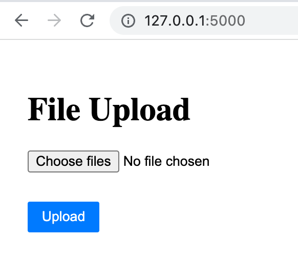
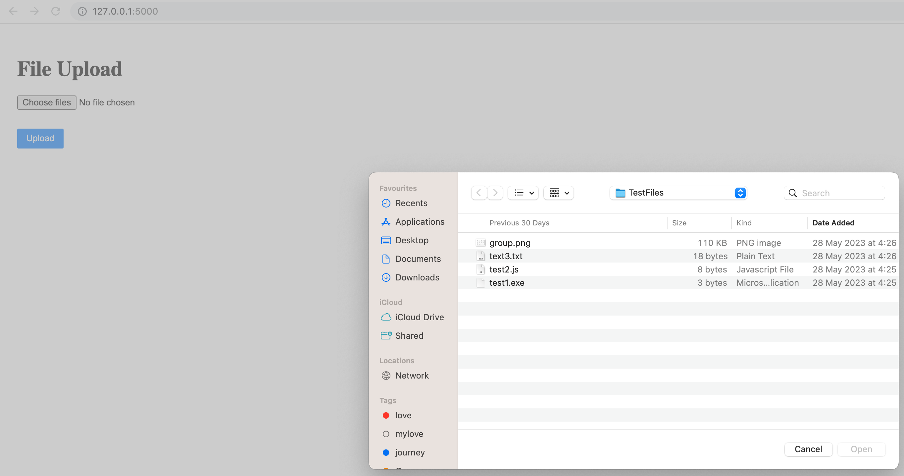
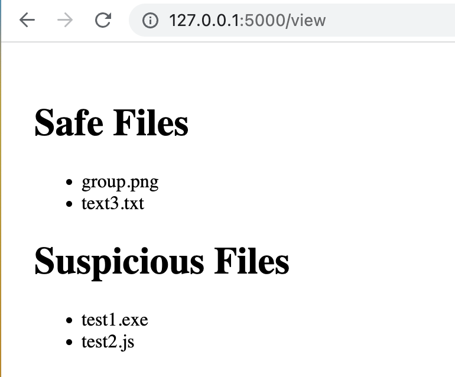

# Automated File Classifier and Safety Assessor

This project demonstrates a multi-agent system for classifying and assessing files. The project consists of four agents:

1. **File Upload Agent**: Responsible for handling the file upload process.
2. **File Classifier Agent**: Determines the file type and classifies files as "safe" or "suspicious" based on a predefined list of potentially harmful file types.
3. **File Movement Agent**: Moves files to their respective folders ("safe" or "suspicious") based on their classification.
4. **View File Agent**: Displays the list of classified files to the user.

## Table of Contents
  * [Used Technologies](#used-technologies)
  * [Project Structure](#project-structure)
  * [How to Run the Application](#how-to-run-the-application)
  * [Features and Implementation](#features-and-implementation)
  * [Unit Testing](#unit-testing)

### Used Technologies
  * Python 3
  * Flask micro web framework

### Project Structure
------------

    |-- README.md          <- README file for the detailed development and 
    |                         testing guide of the application.
    |
    |-- app.py             <- The initial Python file of the application that 
    |                         sets up the Flask server and defines the routes.
    |
    |-- templates          <- The folder that contains HTML files for user 
    |                         interface of the application.
    |    |-- upload.html
    |    |-- view.html
    |
    |-- .gitignore         <- gitignore file that has added the list of cache files 
    |                         to ignore when committing to GitHub.
    |
    |-- images             <- The folder that contains screenshots of the 
    |                          user interface of the application.
    |
    |-- app_test.py        <- Unit test cases for the application.
    |                         

### How to Run the Application
  #### 1. Run on Computer
  * Install [Python 3](https://www.python.org/downloads/) on your machine.
  * Install Flask using pip: **`pip3 install flask`**
  * Download or clone the project from the source repository.
  * Navigate to the project directory from the terminal: **`cd your_file_path/FileClassifier`**.
  * Run the Python program: **`python3 app.py`**
  * Open your web browser and navigate to `http://localhost:5000/` to see the application.

### Features and Implementation
  ##### 1. File Upload
  - Users can upload multiple files at once through the file upload interface.

      
      *Figure.1.1. File Upload Interface*
  
      
      *Figure.1.2. Browse File  Interface*
  
  ##### 4. Viewing Classified Files
  - Users can view the list of classified files on a separate page. Files in both the "safe" and "suspicious" categories are displayed.

      
      *Figure.2.1. Viewing Classified Files*  

### Unit Testing
  The application includes a set of unit tests to verify the functionality of the agents. These tests are contained in the `app_test.py` file and use the `unittest` framework. The `app_test.py` file defines the `AppTestCase` class, which inherits from `unittest.TestCase`.

  #### Test Methods
  The `AppTestCase` class defines several test methods, each testing a specific aspect of the application:
  1. `test_upload_file`: Tests the file upload functionality and checks if the server responds with a 200 status code.
  2. `test_upload_files`: Tests the file upload functionality by uploading a test file and checking if the server responds with a 302 status code.
  3. `test_UploadAgent`: Tests the `UploadAgent` function by uploading a test file and verifying if the file is moved to the appropriate folder.
  4. `test_ClassifierAgent`: Tests the `ClassifierAgent` function by uploading a test file and checking if the file is classified correctly and moved to the appropriate folder.
  5. `test_MoveFileAgent`: Tests the `MoveFileAgent` function by moving a test file to the "safe" folder and verifying if the file exists in the "safe" folder.
  6. `test_view_files`: Tests the file viewing functionality and checks if the server responds with a 200 status code.

  #### Test Setup and Teardown
  The `setUp` method is overridden in the `AppTestCase` class to set up the necessary environment for the tests. It initializes the Flask application and creates a test client. The `tearDown` method is overridden to clean up the test environment after each test. It removes the test file and the files in the "safe" and "suspicious" folders.

  #### Running the Tests
  To run the unit tests, execute the following command in the terminal:
  ```
  python3 -m unittest app_test.py
  ```
  The test runner will execute each test method and provide the test results, indicating whether each test passed or failed.

  The unit tests ensure the correctness of the agents' functionality and help identify any issues or bugs in the application.